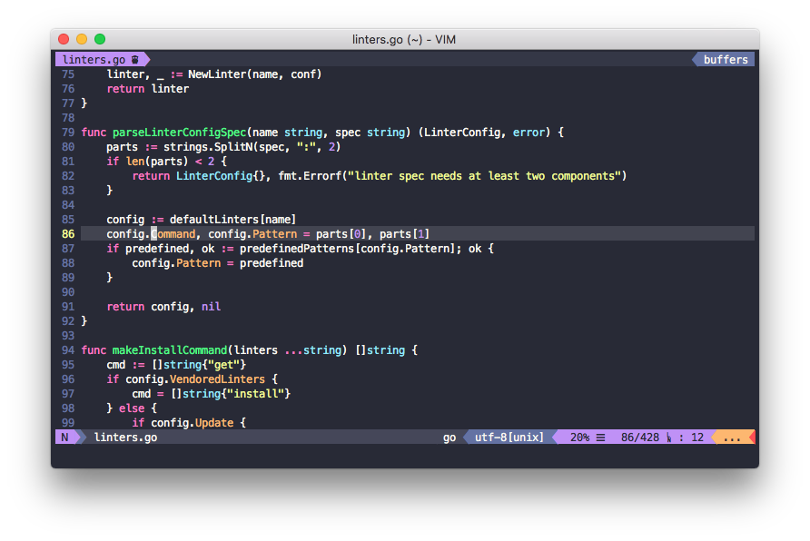
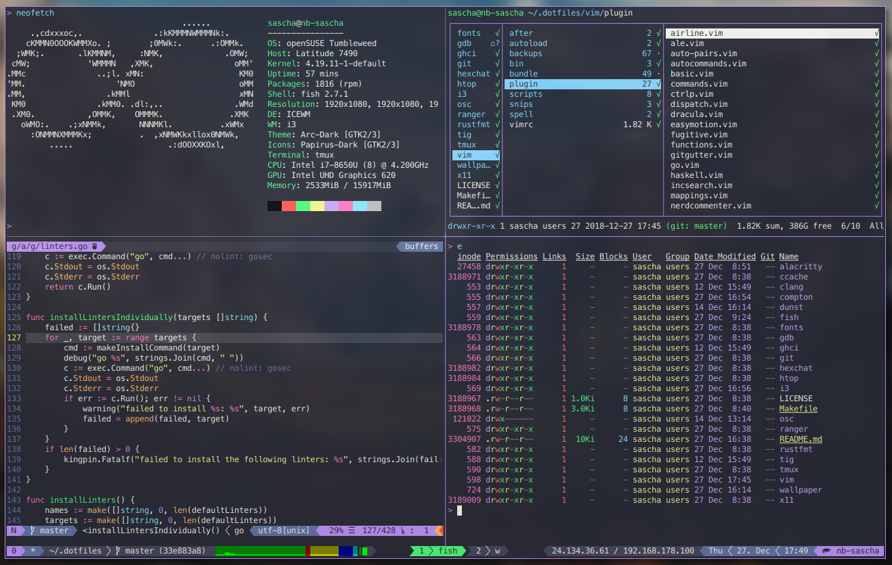

# Dotfiles

### My dotfiles, crafted with ❤️

The following dependencies are needed to use all features from this dotfile
repository:

- **Desktop**:
  - [alacritty](https://github.com/jwilm/alacritty):
    A cross-platform, GPU-accelerated terminal emulator
  - [arc](https://github.com/NicoHood/arc-theme):
    The GTK theme
  - [bibata](https://github.com/KaizIqbal/Bibata_Cursor):
    Beatiful cursor theme
  - [picom](https://github.com/yshui/picom):
    A compositor for X11
  - [dunst](https://github.com/dunst-project/dunst):
    Lightweight and customizable notification daemon
  - [firefox](https://www.mozilla.org/en-US/firefox):
    The well-known browser
  - [feh](https://github.com/derf/feh):
    A fast and light image viewer
  - [hexchat](https://github.com/hexchat/hexchat):
    IRC client
  - [i3](https://github.com/i3/i3):
    A tiling window manager
  - [i3lock-fancy](https://github.com/meskarune/i3lock-fancy):
    A fancy lock screen for i3
  - [i3pystatus](https://github.com/enkore/i3pystatus):
    A complete replacement for i3status
  - [j4-dmenu](https://github.com/enkore/j4-dmenu-desktop):
    The desktop menu
  - [nerd-fonts](https://github.com/ryanoasis/nerd-fonts):
    Iconic fonts
  - [networkManager](https://github.com/NetworkManager/NetworkManager):
    For managing network connections
  - [papirus](https://github.com/PapirusDevelopmentTeam/papirus-icon-theme):
    The icon theme
  - [spotify](https://spotify.com):
    Listening to music
  - [thunderbird](https://www.thunderbird.net):
    Reading and writing mails
  - [unclutter](https://github.com/Airblader/unclutter-xfixes):
    Hides the mouse cursor after a dedicated timeout
  - [x11](https://www.x.org):
    Windowing system
  - [xautolock](https://github.com/l0b0/xautolock):
    Automatically locks the screen after a certain amount of time
- **Vim**:
  - [alex](https://github.com/get-alex/alex):
    Needed for ALE Markdown/asciidoc linting and fixing
  - [cscope](http://cscope.sourceforge.net):
    Tool for source code indexing and querying
  - [ctags](http://ctags.sourceforge.net):
    Generates tags file for source code discovery
  - [floskell](https://github.com/ennocramer/floskell):
    Needed for ALE Haskell linting and fixing
  - [node](https://github.com/nodejs/node):
    Needed for YouCompleteMe typescript/javascript support
  - [npm](https://github.com/npm/cli):
    Needed for YouCompleteMe typescript/javascript support
  - [autopep8](https://github.com/hhatto/autopep8):
    Needed for ALE python linting and fixing
  - [clang-format](https://github.com/llvm-mirror/clang/tree/master/tools/clang-format):
    Needed for ALE C/C++ linting and fixing
  - [golangci-lint](https://github.com/golangci/golangci-lint):
    Needed for ALE golang linting and fixing
  - [hdevtools](https://github.com/hdevtools/hdevtools):
    Needed for ALE haskell linting and fixing
  - [hfmt](https://github.com/danstiner/hfmt):
    Needed for ALE haskelllinting and fixing
  - [hlint](https://github.com/ndmitchell/hlint):
    Needed for ALE haskelllinting and fixing
  - [isort](https://github.com/timothycrosley/isort):
    Needed for ALE python linting and fixing
  - [prettier](https://github.com/prettier/prettier):
    Needed for general ALE linting and fixing
  - [proselint](https://github.com/amperser/proselint):
    Needed for ALE Markdown/asciidoc linting and fixing
  - [rls](https://github.com/rust-lang/rls):
    Needed for ALE rust linting and fixing
  - [rustfmt](https://github.com/rust-lang/rustfmt):
    Needed for ALE rust code formatting
  - [shellcheck](https://github.com/koalaman/shellcheck):
    Needed for ALE bash/sh linting and fixing
  - [shfmt](https://github.com/mvdan/sh):
    Needed for ALE bash/sh linting and fixing
  - [textlint](https://github.com/textlint/textlint):
    Needed for ALE Markdown/asciidoc linting and fixing
  - [tflint](https://github.com/wata727/tflint):
    Needed for ALE terraform linting and fixing
  - [write-good](https://github.com/btford/write-good):
    Needed for ALE Markdown/asciidoc linting and fixing
  - [yapf](https://github.com/google/yapf):
    Needed for ALE python linting and fixing
  - [yamllint](https://github.com/adrienverge/yamllint):
    Needed for ALE yaml linting and fixing
- **Development**:
  - [autojump](https://github.com/wting/autojump):
    A cd command that learns
  - [bat](https://github.com/sharkdp/bat):
    Like `cat` with wings
  - [ccache](https://github.com/ccache/ccache):
    Compiler cache for gcc and clang
  - [cht.sh](https://github.com/chubin/cheat.sh):
    Command line stackoverflow queries
  - [clang](https://github.com/llvm-mirror/clang):
    The LLVM compiler frontend
  - [cmake](https://github.com/Kitware/CMake):
    Cross platform make tool
  - [cppcheck](https://github.com/danmar/cppcheck):
    Linter for C/C++ projects
  - [cpplint](https://github.com/cpplint/cpplint):
    Linter for C/C++ projects
  - [exa](https://github.com/ogham/exa):
    Modern version of `ls`
  - [fd](https://github.com/sharkdp/fd):
    A fast alternative to `find`
  - [fish](https://github.com/fish-shell/fish-shell):
    The interactive shell
  - [fzf](https://github.com/junegunn/fzf):
    Command line fuzzy finder
  - [gdb](https://www.gnu.org/s/gdb):
    The debugger for various kind of projects
  - [ghc](https://github.com/ghc/ghc):
    The glasgow haskell compiler
  - [git](https://github.com/git/git):
    Revision control system
  - [golang](https://github.com/golang):
    The go programminng language
  - [htop](https://github.com/hishamhm/htop):
    Process manager for the terminal
  - [nix](https://nixos.org/nix):
    A powerful functional package manager
  - [osc](https://github.com/openSUSE/osc):
    Command Line Interface to work with an Open Build Service
  - [python](https://github.com/python):
    The python scripting language
  - [rainbarf](https://github.com/creaktive/rainbarf):
    CPU/RAM/battery stats chart bar for tmux
  - [ranger](https://github.com/ranger/ranger):
    VIM-inspired filemanager for the console
  - [ripgrep](https://github.com/BurntSushi/ripgrep):
    Recursively searches directories for a regex pattern
  - [rust](https://github.com/rust-lang/rust):
    The rust programming language
  - [rustup](https://github.com/rust-lang/rustup.rs):
    Rust toolchain and component management
  - [stack](https://github.com/commercialhaskell/stack):
    The haskell tool stack
  - [tig](https://www.openssh.com):
    Command line git explorer
  - [tmux](https://github.com/tmux/tmux):
    Terminal multiplexer
  - [tokei](https://github.com/Aaronepower/tokei):
    Count lines of code quickly
  - [vim](https://github.com/vim):
    The editor

### Vim plugins

The following vim plugins are available via these dotfiles:

- [abolish](https://github.com/tpope/vim-abolish):
  Easily search for, substitute, and abbreviate multiple variants of a word
- [airline](https://github.com/vim-airline/vim-airline):
  Statusline enhancements
- [ale](https://github.com/dense-analysis/ale):
  Asynchronous linter and fixer
- [auto-pairs](https://github.com/jiangmiao/auto-pairs):
  Insert or delete brackets, parens, quotes in pair
- [characterize](https://github.com/tpope/vim-characterize):
  Unicode character metadata
- [commentary](https://github.com/tpope/vim-commentary):
  Easy commenting
- [ctrlp](https://github.com/ctrlpvim/ctrlp.vim):
  Fuzzy file, buffer, mru, tag, etc finder.
- [devicons](https://github.com/ryanoasis/vim-devicons):
  Unicode characters for nerds
- [dispatch](https://github.com/tpope/vim-dispatch):
  Asynchronous build and test dispatcher
- [dracula](https://github.com/saschagrunert/dracula):
  Modified variant of the dracula color scheme
- [easymotion](https://github.com/easymotion/vim-easymotion):
  Efficient movements
- [endwise](https://github.com/tpope/vim-endwise):
  Wisely add endings
- [eunuch](https://github.com/tpope/vim-eunuch):
  Helpers for unix
- [exchange](https://github.com/tommcdo/vim-exchange):
  Easy text exchange operator
- [fish](https://github.com/dag/vim-fish):
  Fish shell syntax
- [fugitive](https://github.com/tpope/vim-fugitive):
  Git on steroids
- [git](https://github.com/tpope/vim-git):
  Git syntax and definitions
- [gitgutter](https://github.com/airblade/vim-gitgutter):
  Git diff in sign column
- [go](https://github.com/fatih/vim-go):
  Enhancements for golang
- [haskell](https://github.com/neovimhaskell/haskell-vim):
  Haskell syntax and definitions
- [incsearch](https://github.com/haya14busa/incsearch.vim):
  Improved incremental searching
- [javascript](https://github.com/pangloss/vim-javascript):
  JavaScript syntax and definitions
- [markdown](https://github.com/tpope/vim-markdown):
  Markdown syntax and definitions
- [operator-user](https://github.com/kana/vim-operator-user):
  Define your own operator easily
- [repeat](https://github.com/tpope/vim-repeat):
  Enable repeating supported plugin maps
- [ripgrep](https://github.com/jremmen/vim-ripgrep):
  Ripgrep search helper
- [rust](https://github.com/rust-lang/rust.vim):
  Rust syntax and definitions
- [schlepp](https://github.com/zirrostig/vim-schlepp):
  Easily moving text selections around
- [scriptease](https://github.com/tpope/vim-scriptease):
  A Vim plugin for Vim plugins
- [snippets](https://github.com/honza/vim-snippets):
  Snippets for ultisnips
- [speeddating](https://github.com/tpope/vim-speeddating):
  Use CTRL-A/CTRL-X to increment dates, times, and more
- [surround](https://github.com/tpope/vim-surround):
  Quoting/parenthesizing made simple
- [tabular](https://github.com/godlygeek/tabular):
  Text filtering and alignment
- [tagbar](https://github.com/majutsushi/tagbar):
  Sidebar for tags
- [targets](https://github.com/wellle/targets.vim):
  Additional text objects
- [textobj-comment](https://github.com/glts/vim-textobj-comment):
  Textobject enhancement for comments
- [textobj-lastpat](https://github.com/kana/vim-textobj-lastpat):
  Textobject enhancement for last searched patterns
- [textobj-user](https://github.com/kana/vim-textobj-user):
  Enables custom textobjects
- [textobj-variable-segment](https://github.com/Julian/vim-textobj-variable-segment):
  Textobject enhancement for variables
- [tmux-navigator](https://github.com/christoomey/vim-tmux-navigator):
  Seamlessly switch between tmux panes and vim
- [tmuxline](https://github.com/edkolev/tmuxline.vim):
  Tmux status line modding
- [typescript](https://github.com/leafgarland/typescript-vim):
  Typescript syntax and definitions
- [ultisnips](https://github.com/SirVer/ultisnips):
  Snipped engine
- [undotree](https://github.com/mbbill/undotree):
  Graphica undo list representation
- [unimpaired](https://github.com/tpope/vim-unimpaired):
  Pairs of handy bracket mappings
- [youcompleteme](https://github.com/Valloric/YouCompleteMe):
  Autocompletion for multiple languages

## Installation

To install all files into your home directory, simply execute:

```fish
> git clone https://github.com/saschagrunert/dotfiles ~/.dotfiles
> cd ~/.dotfiles
> make install USER="John Doe" EMAIL="john@doe.com" SIGNKEY="123"
```

The variables `USER`, `EMAIL` and `SIGNKEY` specify additionally created git
user data.

### Vim

To install all necessary vim plugins you need to run `:PlugInstall` on initial
startup of vim.

## Updating

To update to the latest version of these dotfiles:

```fish
> make update
```

Alternatively you can run `make crontab` which installs a local cron job for
updating the repository every hour.

### Vim

To update all necessary vim plugins you can run `:PlugUpdate` or `:PlugUpdate!`.

## Uninstall

To uninstall all created symlinks and data from your home directory, run:

```fish
> make uninstall
```

## Screenshots




## Contributing

You want to contribute to this project? Wow, thanks! So please just fork it and
submit a pull request.
